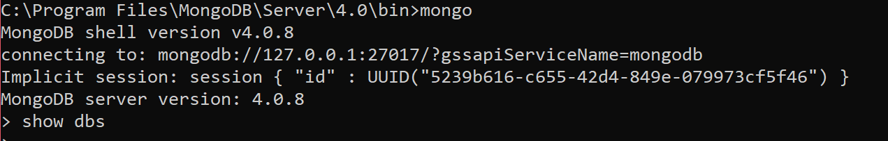
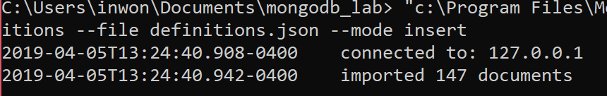
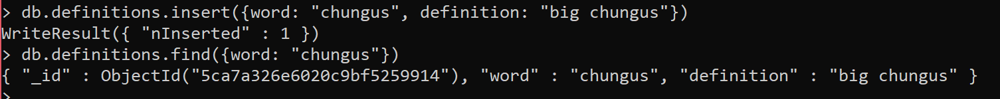
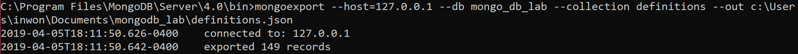

### Lab 10

#### Checkpoint 1  

#### Checkpoint 2

#### Checkpoint 3

###### Screenshot of added elements  
  

##### Screenshot of exporting the db  
#### Checkpoint 4  
I had a really long pprint output, so I cut out the all print one.
```-----random find_one()-----
{u'_id': ObjectId('56fe9e22bad6b23cde07b8be'),
 u'definition': u" n.  Bullshit. No, really. Symbolized by the ``Right Hand Rule,'' see Halliday and Resnick for the formal definition.",
 u'word': u'B-Vector'}
-----find_one(word:chungus)-----
{u'_id': ObjectId('5ca79227e6020c9bf5259913'),
 u'definition': u'big chungus',
 u'word': u'richard'}
-----finding by new_id-----
{u'_id': ObjectId('5ca7e74c06133c02d0ca0be9'),
 u'definition': u'unknown',
 u'word': u'gatorade'}
```

##### Actual script code:  
```python
from pymongo import MongoClient
import pprint
client = MongoClient()

if __name__ == '__main__':
    db = client.mongo_db_lab.definitions
    print("-----find all-----")
    for el in db.find():
        pprint.pprint(el)
    one = db.find_one()
    print("-----random find_one()-----")
    pprint.pprint(one)

    print("-----find_one(word:chungus)-----")
    pprint.pprint(db.find_one({"word": "richard"}))
    new_insert = {
        "definition" : "unknown",
        "word" : "gatorade"
    }
    new_id = db.insert_one(new_insert).inserted_id
    print("-----finding by new_id-----")
    pprint.pprint(db.find_one(new_id))


```
#### Checkpoint 5  

##### terminal output  
```
python checkpoint5.py
2019-04-06 00:02:27.862987
{u'_id': ObjectId('56fe9e22bad6b23cde07b948'),
 u'date': [u'2019-04-06 00:02:27.921502'],
 u'definition': u' n. Air Force ROTC type.',
 u'word': u'Zoomie'}
````

```python
from pymongo import MongoClient
from bson.objectid import ObjectId
import pprint
import datetime

client = MongoClient()


def random_word_requester():
    db = client.mongo_db_lab.definitions
    id = 0
    for el in db.aggregate([{ "$sample": { "size": 1 } }]):
        datenow = str(datetime.datetime.utcnow())
        id = el["_id"]
        db.update({"_id" : id}, {"$push" : {"date" : datenow}})
        
    pprint.pprint(db.find_one(id))
    return 0


if __name__ == '__main__':
    random_word_requester()
```

The word 'Pass-Punt' appeared twice, and this was the result  
##### first time
```

{u'_id': ObjectId('56fe9e22bad6b23cde07b912'), u'date': [u'2019-04-06 00:06:30.499878'],
 u'definition': u" n.  One of the options available to a Tute student. A class on Pass-Punt does not count against you if you fail or do poorly; it also does not help your GPA even if you do incredibly well. Officially called ``Pass-No
Credit.''",
 u'word': u'Pass-Punt'}
 ```
```
{u'_id': ObjectId('56fe9e22bad6b23cde07b912'),
 u'date': [u'2019-04-06 00:06:30.499878', u'2019-04-06 00:06:43.036927'],
 u'definition': u" n.  One of the options available to a Tute student. A class on Pass-Punt does not count against you if you fail or do poorly; it also does not help your GPA even if you do incredibly well. Officially called ``Pass-No
Credit.''",
 u'word': u'Pass-Punt'}
 ```