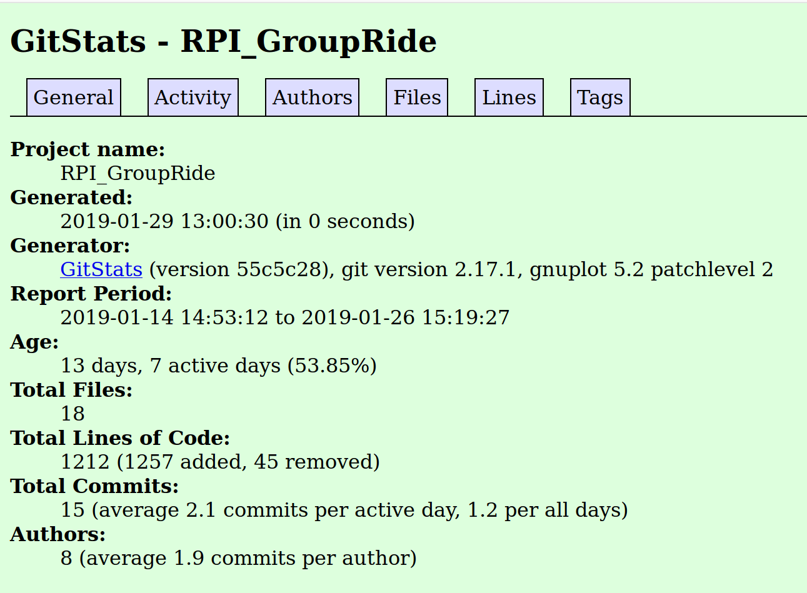
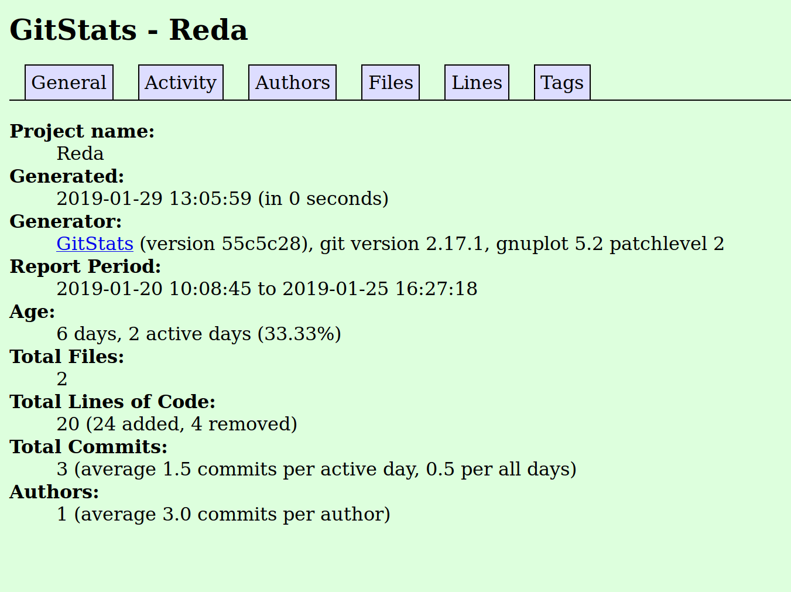
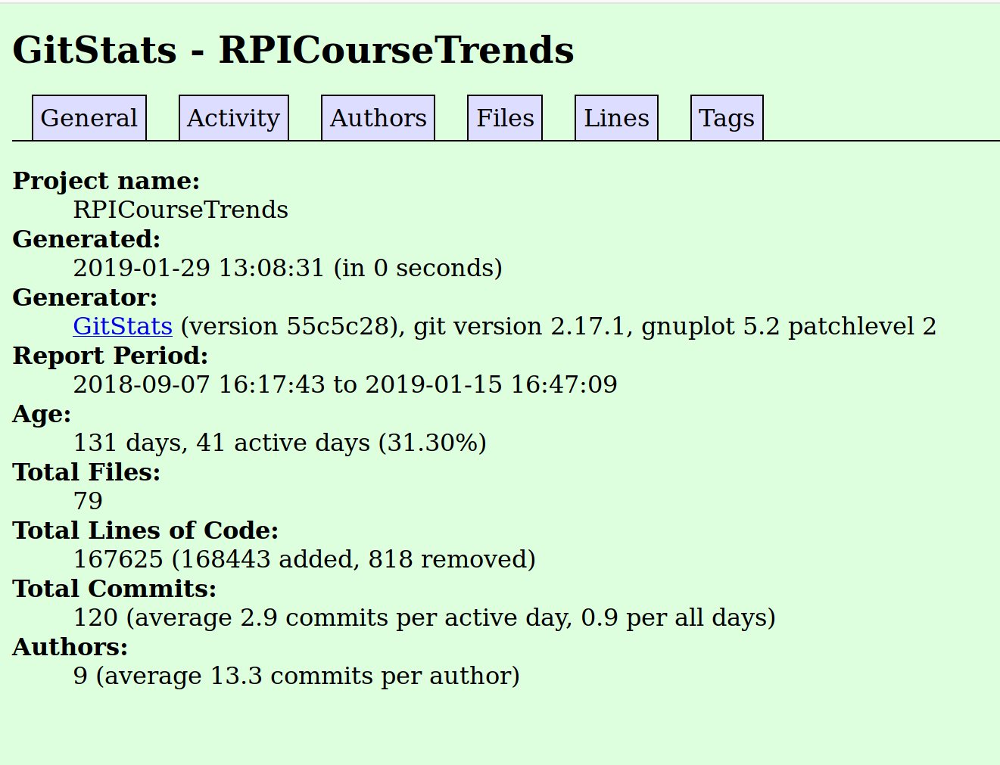
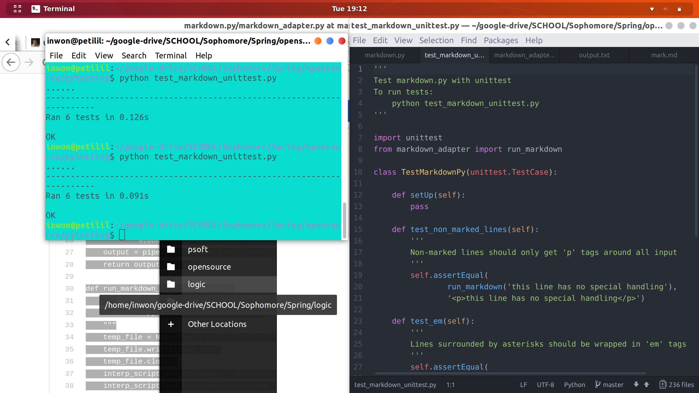
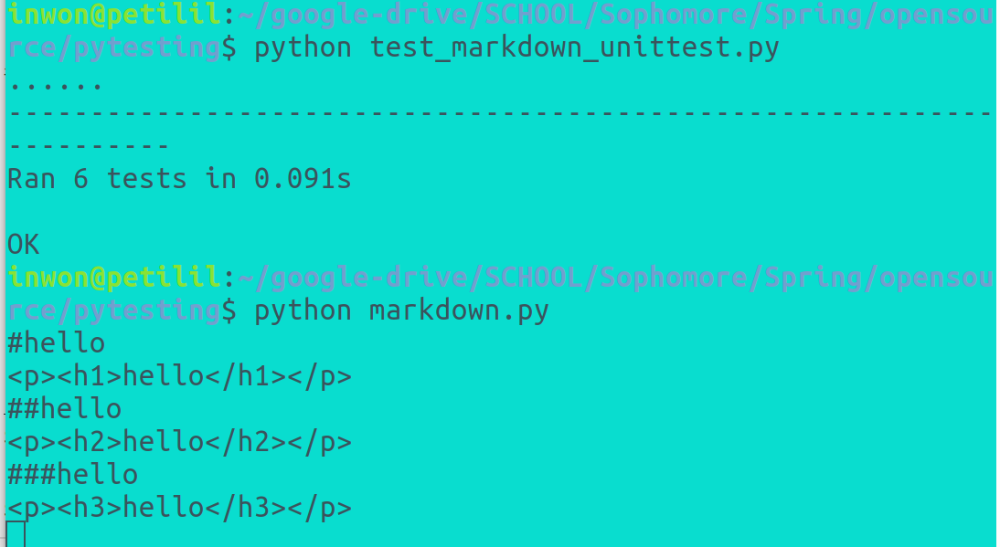

###RPI_GroUber  
-Number of contributors: 6  
-Number of lines of code: 55  
-First commit: 3214d376a89a3792311662c10291c9e31b197cfc (Jan 14, 2019)  
-Latest commit: 5c15fa6b6593210809cca45c5d10be3e3cfdcc5a (Jan 26, 2019)  
-Current branches: master, create-account, add-liscense-1

  
###Campus Map  
-Number of contributors: 4  
-22309 lines  
-first commit sept 28, 2018  
-last commit jan 25 2019  
-12:43 PM  
-1 branch  

  
###Reda  
-Number of contributors: 1  
-Codes: 20 lines  
-First commit: 21d65dd33002a0364635b792a6c9bf490a7661c3 'Initial commit'  
-Latest commit: 4daba655d5a2c2b88ecdbf576209b07283f0e19c 'Update LICENSE'  
-Current branch: master  

  
###RPICourseTrends  
-Number of contributors: 5  
-Codes: 162112 lines  
-First commit: a1e873f150f62158a074b5c784def0f87b186c9a 'Initial commit'  
-Latest commit: ad8be1be0f286872b6a44928bbaf6b4d536f2ec9 'Update README.md'  
-Current branch: master  

###RPIEye
-Number of Contributors: 18 
-Number of lines of code: 76224 
-First commit: 91d45a2a945f4ee225c405d334f688561973b8ad Oct. 1, 2018 
-Latest commit: f4d9c1db0415656d38a4dd3e39ed6b17578a5ec1 Jan. 22, 2019 
-Current branches: master, Crawler, Indexing, Link-Analysis, Ranking, Text-Transformation, UI-UX  

[Link to the markdown.py test ](https://github.com/inwonakng/open_source_labs/tree/master/markdowntest)
Screenshot of test success with 3 extra cases: 

Screenshot of the header translate working: 

[Link to youtube playlist of gource output of the five projects](https://www.youtube.com/playlist?list=PLqK4XFvVMI8WY_5vDILij_2Bfbp2nEowM)

