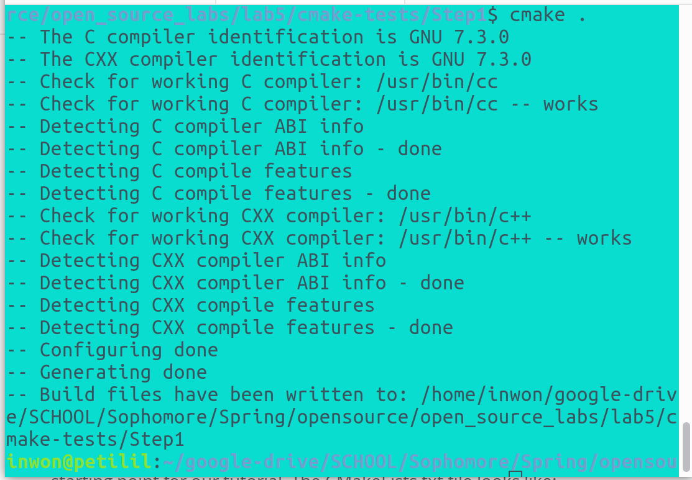
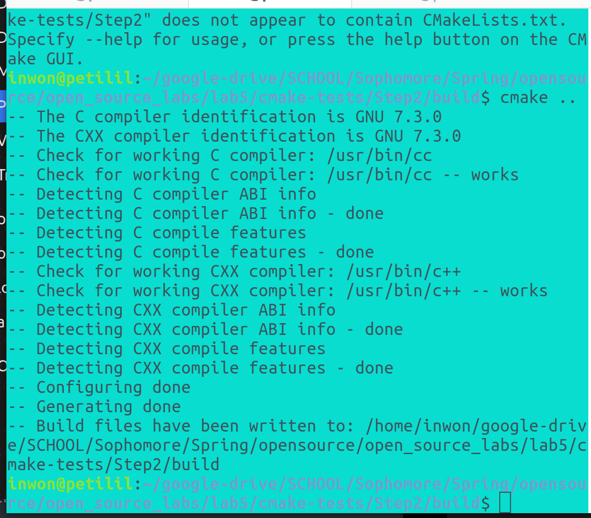
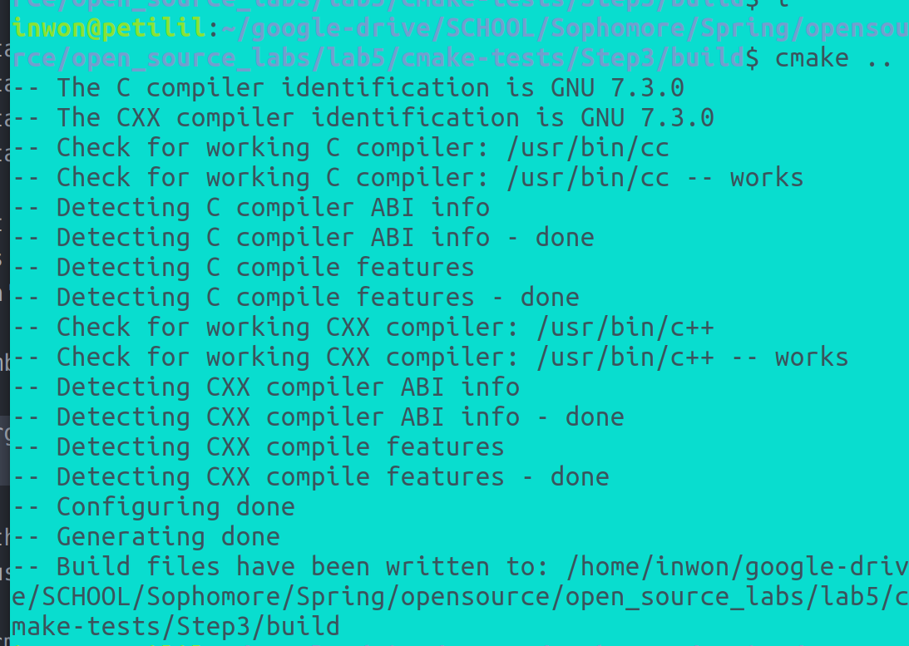
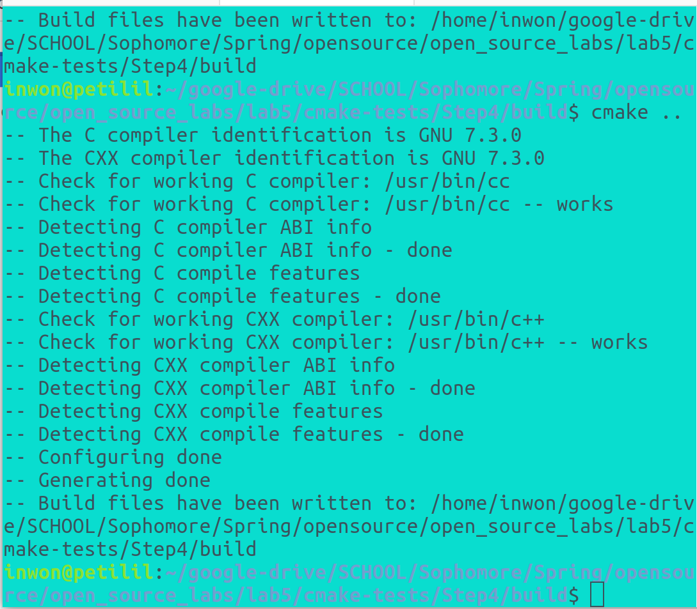
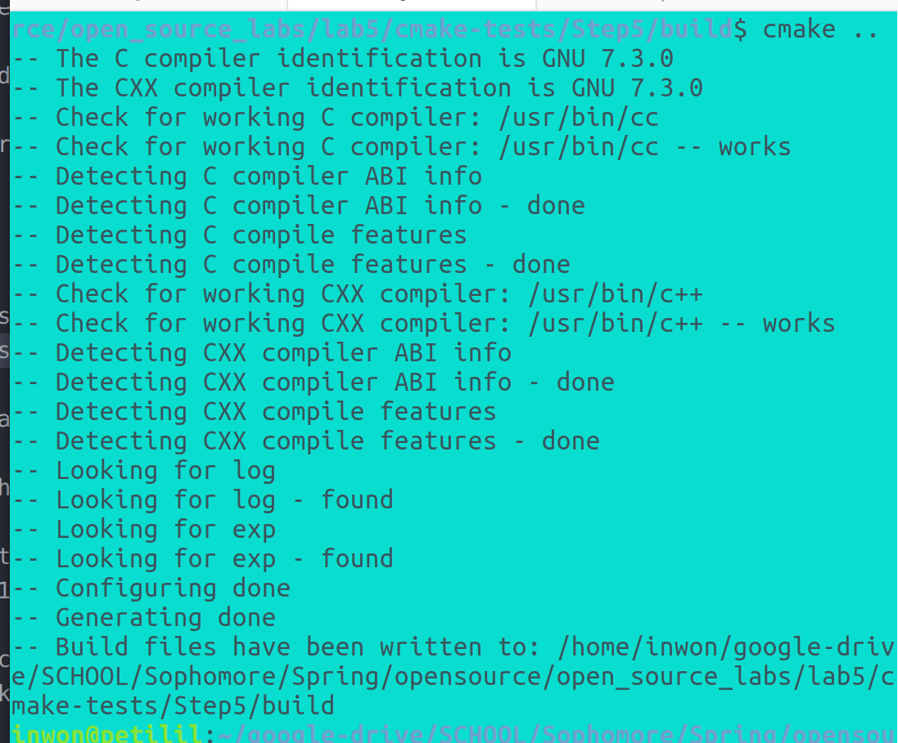
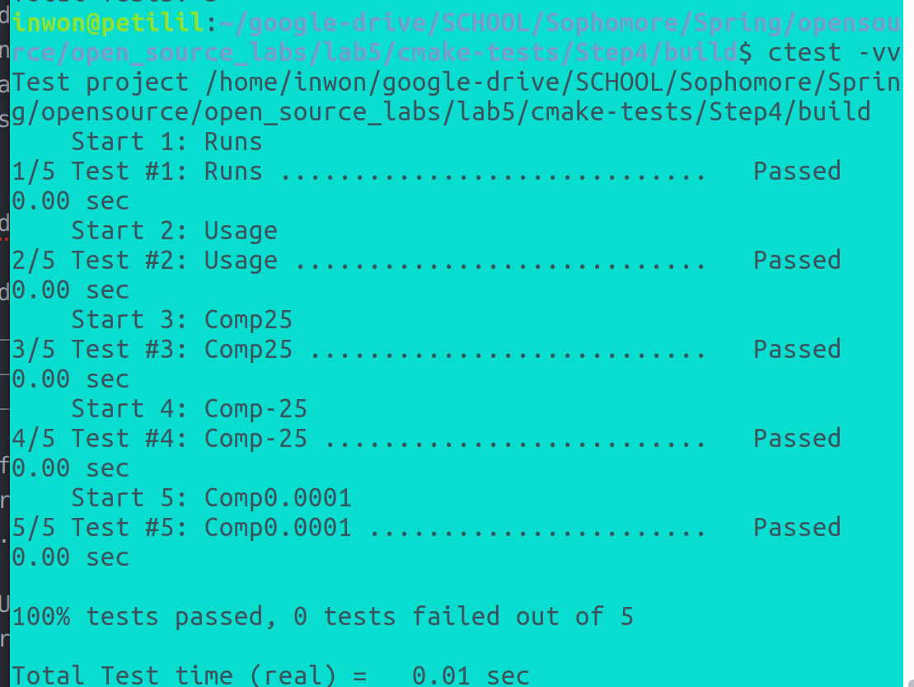
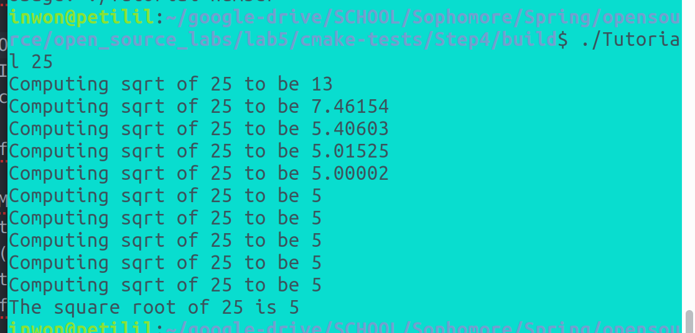
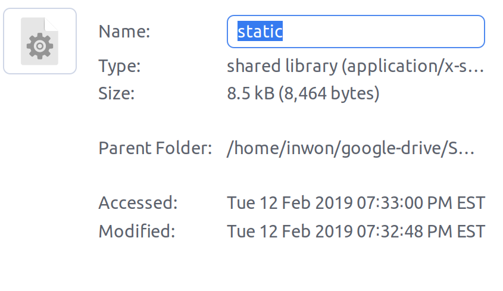
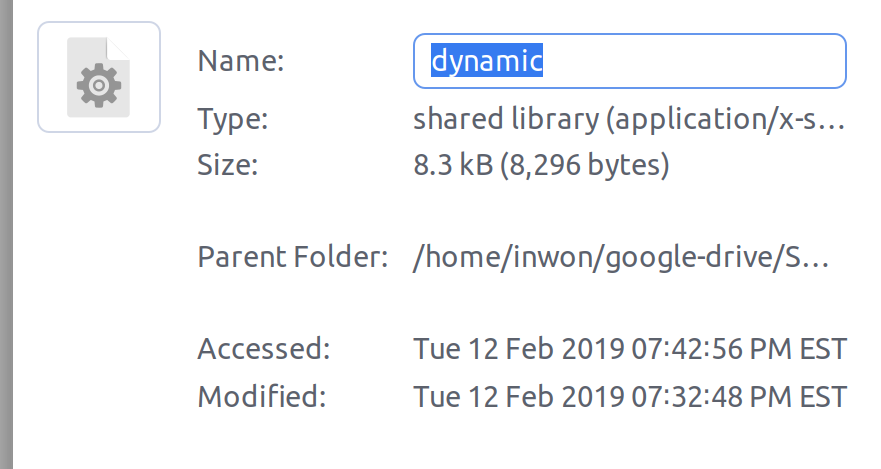

### Lab 5

Screenshots of Step 1 through 5

  
  
  
  
  

Screenshot of the ctests and running the executable

  

size of dynamic and static:

My Makefile:
all:static_block dynamic_block

static_block:program.o libstatic.a
	cc -lm -o static_block program.o libstatic.a -L. -lstatic
dynamic_block:program.o libdynamic.so
	cc program.o libdynamic.so -o dynamic_block -Wl,-rpath='$$ORIGIN'

program.o:program.c headers/block.h
	cc -O -c program.c

libstatic.a:block.o
	ar rcs libstatic.a block.o

libdynamic.so:block.o
	cc -shared -o libdynamic.so block.o

block.o:source/block.c headers/block.h
	cc -O -c source/block.c

lib:libdynamic.so libstatic.a

CMake file:
cmake_minimum_required(VERSION 3.0)
project(dynamic)
project(static)

ADD_LIBRARY( MyStaticLib STATIC block.c )

ADD_LIBRARY(MyDynaLib SHARED block.c)

ADD_EXECUTABLE( dynamic ../program.c )
ADD_EXECUTABLE(static ../program.c)

TARGET_LINK_LIBRARIES(static MyStaticLib )
TARGET_LINK_LIBRARIES(dynamic MyDynaLib)

Makefile generated by cmake:
# CMAKE generated file: DO NOT EDIT!
# Generated by "Unix Makefiles" Generator, CMake Version 3.10

# Default target executed when no arguments are given to make.
default_target: all

.PHONY : default_target

# Allow only one "make -f Makefile2" at a time, but pass parallelism.
.NOTPARALLEL:

#=============================================================================
# Special targets provided by cmake.

# Disable implicit rules so canonical targets will work.
.SUFFIXES:

# Remove some rules from gmake that .SUFFIXES does not remove.
SUFFIXES =

.SUFFIXES: .hpux_make_needs_suffix_list

# Suppress display of executed commands.
$(VERBOSE).SILENT:

# A target that is always out of date.
cmake_force:

.PHONY : cmake_force

#=============================================================================
# Set environment variables for the build.

# The shell in which to execute make rules.
SHELL = /bin/sh

# The CMake executable.
CMAKE_COMMAND = /usr/bin/cmake

# The command to remove a file.
RM = /usr/bin/cmake -E remove -f

# Escaping for special characters.
EQUALS = =

# The top-level source directory on which CMake was run.
CMAKE_SOURCE_DIR = /home/inwon/google-drive/SCHOOL/Sophomore/Spring/opensource/open_source_labs/lab5/Lab-Example/source

# The top-level build directory on which CMake was run.
CMAKE_BINARY_DIR = /home/inwon/google-drive/SCHOOL/Sophomore/Spring/opensource/open_source_labs/lab5/Lab-Example/build

#=============================================================================
# Targets provided globally by CMake.

# Special rule for the target rebuild_cache
rebuild_cache:
	@$(CMAKE_COMMAND) -E cmake_echo_color --switch=$(COLOR) --cyan "Running CMake to regenerate build system..."
	/usr/bin/cmake -H$(CMAKE_SOURCE_DIR) -B$(CMAKE_BINARY_DIR)
.PHONY : rebuild_cache

# Special rule for the target rebuild_cache
rebuild_cache/fast: rebuild_cache

.PHONY : rebuild_cache/fast

# Special rule for the target edit_cache
edit_cache:
	@$(CMAKE_COMMAND) -E cmake_echo_color --switch=$(COLOR) --cyan "Running CMake cache editor..."
	/usr/bin/cmake-gui -H$(CMAKE_SOURCE_DIR) -B$(CMAKE_BINARY_DIR)
.PHONY : edit_cache

# Special rule for the target edit_cache
edit_cache/fast: edit_cache

.PHONY : edit_cache/fast

# The main all target
all: cmake_check_build_system
	$(CMAKE_COMMAND) -E cmake_progress_start /home/inwon/google-drive/SCHOOL/Sophomore/Spring/opensource/open_source_labs/lab5/Lab-Example/build/CMakeFiles /home/inwon/google-drive/SCHOOL/Sophomore/Spring/opensource/open_source_labs/lab5/Lab-Example/build/CMakeFiles/progress.marks
	$(MAKE) -f CMakeFiles/Makefile2 all
	$(CMAKE_COMMAND) -E cmake_progress_start /home/inwon/google-drive/SCHOOL/Sophomore/Spring/opensource/open_source_labs/lab5/Lab-Example/build/CMakeFiles 0
.PHONY : all

# The main clean target
clean:
	$(MAKE) -f CMakeFiles/Makefile2 clean
.PHONY : clean

# The main clean target
clean/fast: clean

.PHONY : clean/fast

# Prepare targets for installation.
preinstall: all
	$(MAKE) -f CMakeFiles/Makefile2 preinstall
.PHONY : preinstall

# Prepare targets for installation.
preinstall/fast:
	$(MAKE) -f CMakeFiles/Makefile2 preinstall
.PHONY : preinstall/fast

# clear depends
depend:
	$(CMAKE_COMMAND) -H$(CMAKE_SOURCE_DIR) -B$(CMAKE_BINARY_DIR) --check-build-system CMakeFiles/Makefile.cmake 1
.PHONY : depend

#=============================================================================
# Target rules for targets named static

# Build rule for target.
static: cmake_check_build_system
	$(MAKE) -f CMakeFiles/Makefile2 static
.PHONY : static

# fast build rule for target.
static/fast:
	$(MAKE) -f CMakeFiles/static.dir/build.make CMakeFiles/static.dir/build
.PHONY : static/fast

#=============================================================================
# Target rules for targets named dynamic

# Build rule for target.
dynamic: cmake_check_build_system
	$(MAKE) -f CMakeFiles/Makefile2 dynamic
.PHONY : dynamic

# fast build rule for target.
dynamic/fast:
	$(MAKE) -f CMakeFiles/dynamic.dir/build.make CMakeFiles/dynamic.dir/build
.PHONY : dynamic/fast

#=============================================================================
# Target rules for targets named MyStaticLib

# Build rule for target.
MyStaticLib: cmake_check_build_system
	$(MAKE) -f CMakeFiles/Makefile2 MyStaticLib
.PHONY : MyStaticLib

# fast build rule for target.
MyStaticLib/fast:
	$(MAKE) -f CMakeFiles/MyStaticLib.dir/build.make CMakeFiles/MyStaticLib.dir/build
.PHONY : MyStaticLib/fast

#=============================================================================
# Target rules for targets named MyDynaLib

# Build rule for target.
MyDynaLib: cmake_check_build_system
	$(MAKE) -f CMakeFiles/Makefile2 MyDynaLib
.PHONY : MyDynaLib

# fast build rule for target.
MyDynaLib/fast:
	$(MAKE) -f CMakeFiles/MyDynaLib.dir/build.make CMakeFiles/MyDynaLib.dir/build
.PHONY : MyDynaLib/fast

block.o: block.c.o

.PHONY : block.o

# target to build an object file
block.c.o:
	$(MAKE) -f CMakeFiles/MyStaticLib.dir/build.make CMakeFiles/MyStaticLib.dir/block.c.o
	$(MAKE) -f CMakeFiles/MyDynaLib.dir/build.make CMakeFiles/MyDynaLib.dir/block.c.o
.PHONY : block.c.o

block.i: block.c.i

.PHONY : block.i

# target to preprocess a source file
block.c.i:
	$(MAKE) -f CMakeFiles/MyStaticLib.dir/build.make CMakeFiles/MyStaticLib.dir/block.c.i
	$(MAKE) -f CMakeFiles/MyDynaLib.dir/build.make CMakeFiles/MyDynaLib.dir/block.c.i
.PHONY : block.c.i

block.s: block.c.s

.PHONY : block.s

# target to generate assembly for a file
block.c.s:
	$(MAKE) -f CMakeFiles/MyStaticLib.dir/build.make CMakeFiles/MyStaticLib.dir/block.c.s
	$(MAKE) -f CMakeFiles/MyDynaLib.dir/build.make CMakeFiles/MyDynaLib.dir/block.c.s
.PHONY : block.c.s

home/inwon/google-drive/SCHOOL/Sophomore/Spring/opensource/open_source_labs/lab5/Lab-Example/program.o: home/inwon/google-drive/SCHOOL/Sophomore/Spring/opensource/open_source_labs/lab5/Lab-Example/program.c.o

.PHONY : home/inwon/google-drive/SCHOOL/Sophomore/Spring/opensource/open_source_labs/lab5/Lab-Example/program.o

# target to build an object file
home/inwon/google-drive/SCHOOL/Sophomore/Spring/opensource/open_source_labs/lab5/Lab-Example/program.c.o:
	$(MAKE) -f CMakeFiles/static.dir/build.make CMakeFiles/static.dir/home/inwon/google-drive/SCHOOL/Sophomore/Spring/opensource/open_source_labs/lab5/Lab-Example/program.c.o
	$(MAKE) -f CMakeFiles/dynamic.dir/build.make CMakeFiles/dynamic.dir/home/inwon/google-drive/SCHOOL/Sophomore/Spring/opensource/open_source_labs/lab5/Lab-Example/program.c.o
.PHONY : home/inwon/google-drive/SCHOOL/Sophomore/Spring/opensource/open_source_labs/lab5/Lab-Example/program.c.o

home/inwon/google-drive/SCHOOL/Sophomore/Spring/opensource/open_source_labs/lab5/Lab-Example/program.i: home/inwon/google-drive/SCHOOL/Sophomore/Spring/opensource/open_source_labs/lab5/Lab-Example/program.c.i

.PHONY : home/inwon/google-drive/SCHOOL/Sophomore/Spring/opensource/open_source_labs/lab5/Lab-Example/program.i

# target to preprocess a source file
home/inwon/google-drive/SCHOOL/Sophomore/Spring/opensource/open_source_labs/lab5/Lab-Example/program.c.i:
	$(MAKE) -f CMakeFiles/static.dir/build.make CMakeFiles/static.dir/home/inwon/google-drive/SCHOOL/Sophomore/Spring/opensource/open_source_labs/lab5/Lab-Example/program.c.i
	$(MAKE) -f CMakeFiles/dynamic.dir/build.make CMakeFiles/dynamic.dir/home/inwon/google-drive/SCHOOL/Sophomore/Spring/opensource/open_source_labs/lab5/Lab-Example/program.c.i
.PHONY : home/inwon/google-drive/SCHOOL/Sophomore/Spring/opensource/open_source_labs/lab5/Lab-Example/program.c.i

home/inwon/google-drive/SCHOOL/Sophomore/Spring/opensource/open_source_labs/lab5/Lab-Example/program.s: home/inwon/google-drive/SCHOOL/Sophomore/Spring/opensource/open_source_labs/lab5/Lab-Example/program.c.s

.PHONY : home/inwon/google-drive/SCHOOL/Sophomore/Spring/opensource/open_source_labs/lab5/Lab-Example/program.s

# target to generate assembly for a file
home/inwon/google-drive/SCHOOL/Sophomore/Spring/opensource/open_source_labs/lab5/Lab-Example/program.c.s:
	$(MAKE) -f CMakeFiles/static.dir/build.make CMakeFiles/static.dir/home/inwon/google-drive/SCHOOL/Sophomore/Spring/opensource/open_source_labs/lab5/Lab-Example/program.c.s
	$(MAKE) -f CMakeFiles/dynamic.dir/build.make CMakeFiles/dynamic.dir/home/inwon/google-drive/SCHOOL/Sophomore/Spring/opensource/open_source_labs/lab5/Lab-Example/program.c.s
.PHONY : home/inwon/google-drive/SCHOOL/Sophomore/Spring/opensource/open_source_labs/lab5/Lab-Example/program.c.s

# Help Target
help:
	@echo "The following are some of the valid targets for this Makefile:"
	@echo "... all (the default if no target is provided)"
	@echo "... clean"
	@echo "... depend"
	@echo "... rebuild_cache"
	@echo "... edit_cache"
	@echo "... static"
	@echo "... dynamic"
	@echo "... MyStaticLib"
	@echo "... MyDynaLib"
	@echo "... block.o"
	@echo "... block.i"
	@echo "... block.s"
	@echo "... home/inwon/google-drive/SCHOOL/Sophomore/Spring/opensource/open_source_labs/lab5/Lab-Example/program.o"
	@echo "... home/inwon/google-drive/SCHOOL/Sophomore/Spring/opensource/open_source_labs/lab5/Lab-Example/program.i"
	@echo "... home/inwon/google-drive/SCHOOL/Sophomore/Spring/opensource/open_source_labs/lab5/Lab-Example/program.s"
.PHONY : help

#=============================================================================
# Special targets to cleanup operation of make.

# Special rule to run CMake to check the build system integrity.
# No rule that depends on this can have commands that come from listfiles
# because they might be regenerated.
cmake_check_build_system:
	$(CMAKE_COMMAND) -H$(CMAKE_SOURCE_DIR) -B$(CMAKE_BINARY_DIR) --check-build-system CMakeFiles/Makefile.cmake 0
.PHONY : cmake_check_build_system
