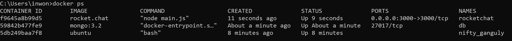
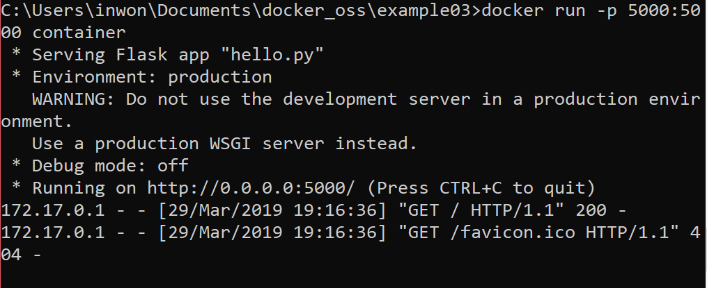
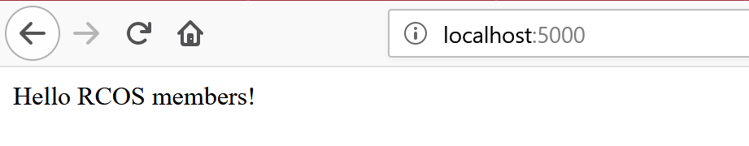

## Lab 9

#### Screenshot of example 00  

#### Screenshots of example 01  
Screenshot of test file with vim  

Screenshot of cowsay "moo!"  

#### Screenshot of example 02

#### Screenshots of example 03

Screenshot of running the server  

Screenshot of server running  

I couldn't get example 4 to build properly, going to try again later.